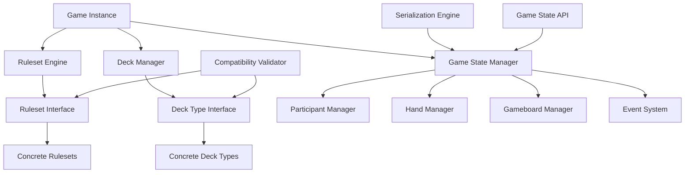

# BigDeckEnergy Design Document

## Overview

BigDeckEnergy (BDE) is designed as a modular, extensible TypeScript card game library distributed as an npm package. The library separates concerns between deck types, game rulesets, and game state management. The architecture follows a plugin-based approach where deck types and rulesets can be developed independently and combined at runtime with compatibility validation.

The core design principle is composition over inheritance, allowing maximum flexibility in combining different game elements while maintaining type safety and clear interfaces.

**Package Information:**
- **Package Name:** `big-deck-energy` (or `@bigdeckenergy/core` for scoped package)
- **Language:** TypeScript 5.0+
- **Target:** ES2020+ with CommonJS and ES Module builds
- **Type Definitions:** Full TypeScript definitions included

## Architecture

### High-Level Architecture



### Core Architectural Patterns

1. **Strategy Pattern**: Rulesets and deck types implement common interfaces
2. **Observer Pattern**: Event system for card interactions and game state changes
3. **Factory Pattern**: Creation of game instances with validated combinations
4. **State Pattern**: Game phase management and turn transitions
5. **Plugin Architecture**: Runtime loading and registration of rulesets and deck types

## Components and Interfaces

### Core Interfaces

#### Card Interface
```typescript
interface Card {
  readonly id: string;
  readonly faceId: string;
  readonly tailId: string;
  readonly deckType: string;
  readonly properties: Record<string, any>;
}

enum CardOrientation {
  NORMAL = 'normal',
  ROTATED_90 = 'rotated_90',
  ROTATED_180 = 'rotated_180',
  ROTATED_270 = 'rotated_270'
}
```

#### Deck Type Interface
```typescript
interface DeckType {
  readonly name: string;
  readonly faces: Map<string, string>; // face-id to image URL/path
  readonly tails: Map<string, string>; // tail-id to image URL/path
  readonly cards: CardDefinition[];
  
  createDeck(): Card[];
  validateCard(card: Card): boolean;
}

interface CardDefinition {
  readonly id: string;
  readonly faceId: string;
  readonly tailId: string;
  readonly properties: Record<string, any>;
}
```

#### Ruleset Interface
```typescript
interface Ruleset {
  readonly name: string;
  readonly minPlayers: number;
  readonly maxPlayers: number;
  readonly compatibleDeckTypes: string[];
  
  setup(gameState: GameState, deckType: DeckType): GameState;
  gameloop(gameState: GameState): GameLoopResult;
  validate(gameState: GameState): ValidationError[];
  wincondition(gameState: GameState): WinResult;
}

interface GameLoopResult {
  readonly canContinue: boolean;
  readonly updatedGameState: GameState;
  readonly requiresParticipantInteraction: boolean;
}

interface ValidationError {
  readonly code: string;
  readonly message: string;
  readonly severity: 'error' | 'warning';
}

interface WinResult {
  readonly gameEnded: boolean;
  readonly winners: string[];
  readonly reason: string;
}

interface ParticipantAction {
  readonly type: string;
  readonly participantId: string;
  readonly data: Record<string, any>;
}

interface GameEvent {
  readonly id: string;
  readonly type: string;
  readonly timestamp: number;
  readonly participantId?: string;
  readonly data: Record<string, any>;
}
```

#### Game State Interface
```typescript
interface GameState {
  readonly gameId: string;
  readonly phase: GamePhase;
  readonly gameboard: Gameboard;
  readonly participants: Map<string, Participant>;
  readonly hands: Map<string, Hand>;
  readonly events: GameEvent[];
  readonly metadata: Record<string, any>;
}

interface Participant {
  readonly id: string;
  readonly name: string;
  readonly isNPC: boolean;
  readonly handIds: string[];
  readonly status: Record<string, any>;
}

interface Gameboard {
  readonly piles: Map<string, CardPile>;
  readonly placements: Map<string, CardPlacement>;
  readonly status: Record<string, any>;
}

interface Hand {
  readonly id: string;
  readonly name: string;
  readonly participantId: string;
  readonly piles: Map<string, CardPile>;
  readonly placements: Map<string, CardPlacement>;
  readonly status: Record<string, any>;
}

interface CardPile {
  readonly name: string;
  readonly cards: CardInPile[];
  readonly isOrdered: boolean;
  readonly orientation: CardOrientation;
  readonly status: Record<string, any>;
}

interface CardPlacement {
  readonly name: string;
  readonly card: CardInPlacement | null;
  readonly orientation: CardOrientation;
  readonly status: Record<string, any>;
}

interface CardInPile {
  readonly card: Card;
  readonly faceUp: boolean;
  readonly orientation: CardOrientation;
  readonly owner: string | null; // Participant ID who owns this card
  readonly status: Record<string, any>;
}

interface CardInPlacement {
  readonly card: Card;
  readonly faceUp: boolean;
  readonly orientation: CardOrientation;
  readonly owner: string | null; // Participant ID who owns this card
  readonly status: Record<string, any>;
}
```

### Component Responsibilities

#### Game Instance Manager
- Orchestrates game creation and lifecycle
- Validates ruleset-deck compatibility
- Manages game state transitions
- Provides public API for game operations

#### Compatibility Validator
- Checks that deck types are in the ruleset's compatible deck types list
- Validates that only one deck type is used per game instance
- Provides detailed compatibility reports
- Prevents invalid game configurations and deck mixing

#### Event System
- Automatically tracks game state changes (card ownership transfer, face-up/down changes, etc.)
- Allows rulesets to define and emit custom event types
- Maintains complete event history for debugging, replay, and game analysis
- Hooks into all Game State API calls to record state changes
- Provides event filtering and querying capabilities

#### Serialization Engine
- Converts game state to/from JSON
- Handles custom property serialization
- Supports versioning for backward compatibility
- Enables save/load functionality

## Data Models

### Game State API
```typescript
interface GameStateAPI {
  // Participant Management
  createParticipant(id: string, name: string, isNPC: boolean): void;
  updateParticipantStatus(participantId: string, key: string, value: any): void;
  addHandToParticipant(participantId: string, handId: string): void;
  removeHandFromParticipant(participantId: string, handId: string): void;
  getParticipant(participantId: string): Participant | null;
  
  // Hand Management
  createHand(handId: string, name: string, participantId: string): void;
  createHandPile(handId: string, pileName: string, isOrdered: boolean, orientation?: CardOrientation): void;
  addCardToHandPile(handId: string, pileName: string, card: Card, faceUp: boolean, owner?: string, orientation?: CardOrientation, status?: Record<string, any>): void;
  removeCardFromHandPile(handId: string, pileName: string, index?: number): CardInPile | null;
  setHandPlacement(handId: string, placementName: string, card: Card | null, faceUp?: boolean, owner?: string, orientation?: CardOrientation, status?: Record<string, any>): void;
  getHandPlacement(handId: string, placementName: string): CardInPlacement | null;
  updateHandStatus(handId: string, key: string, value: any): void;
  
  // Gameboard Management
  createGameboardPile(name: string, isOrdered: boolean, orientation?: CardOrientation): void;
  addCardToGameboardPile(pileName: string, card: Card, faceUp: boolean, owner?: string, orientation?: CardOrientation, status?: Record<string, any>): void;
  removeCardFromGameboardPile(pileName: string, index?: number): CardInPile | null;
  setGameboardPlacement(placementName: string, card: Card | null, faceUp?: boolean, owner?: string, orientation?: CardOrientation, status?: Record<string, any>): void;
  getGameboardPlacement(placementName: string): CardInPlacement | null;
  updateGameboardStatus(key: string, value: any): void;
  
  // Card State Management
  updateCardInPileStatus(location: 'gameboard' | string, pileName: string, cardIndex: number, key: string, value: any): void;
  updateCardInPlacementStatus(location: 'gameboard' | string, placementName: string, key: string, value: any): void;
  updateCardOwnership(location: 'gameboard' | string, pileName: string, cardIndex: number, newOwner: string | null): void;
  flipCard(location: 'gameboard' | string, pileName: string, cardIndex: number, faceUp: boolean): void;
  
  // Utility Functions
  shufflePile(location: 'gameboard' | string, pileName: string): void;
  moveCard(fromLocation: 'gameboard' | string, fromPile: string, fromIndex: number, toLocation: 'gameboard' | string, toPile: string): void;
  
  // Visibility and Access Control
  canAccessPile(participantId: string, location: 'gameboard' | string, pileName: string): boolean;
  canAccessPlacement(participantId: string, location: 'gameboard' | string, placementName: string): boolean;
  getVisibleCards(participantId: string, location: 'gameboard' | string, pileName: string): CardInPile[];
  
  // Event Management
  addEvent(event: GameEvent): void;
  getEvents(filter?: EventFilter): GameEvent[];
}

interface EventFilter {
  type?: string;
  participantId?: string;
  since?: number;
}
```

### Game Phase Management
```typescript
enum GamePhase {
  SETUP = 'setup',
  DEALING = 'dealing',
  PLAYING = 'playing',
  SCORING = 'scoring',
  FINISHED = 'finished'
}
```

### Built-in Deck Types

#### Standard Playing Cards
- 52 cards with traditional suits (Hearts, Diamonds, Clubs, Spades)
- Ranks: A, 2-10, J, Q, K
- Numeric values: A=1/14, 2-10=face value, J=11, Q=12, K=13
- Capabilities: SUITS, RANKS, NUMERIC_VALUES

#### Custom Deck Template
- Flexible card definition system
- Developer-defined properties and behaviors
- Runtime validation of card constraints
- Support for special abilities and interactions

## Error Handling

### Error Categories
1. **Compatibility Errors**: Invalid ruleset-deck combinations
2. **Validation Errors**: Invalid player actions or game states
3. **Configuration Errors**: Malformed deck types or rulesets
4. **Runtime Errors**: Unexpected game state conditions

### Error Handling Strategy
- Fail-fast validation during game creation
- Graceful degradation for non-critical errors
- Detailed error messages with suggested fixes
- Error recovery mechanisms for transient issues

### Error Types
```typescript
class CompatibilityError extends Error {
  constructor(
    public readonly ruleset: string,
    public readonly deckType: string,
    public readonly compatibleTypes: string[]
  ) {
    super(`Ruleset '${ruleset}' is not compatible with deck type '${deckType}'. Compatible types: ${compatibleTypes.join(', ')}`);
  }
}

class DeckMixingError extends Error {
  constructor(
    public readonly attemptedDeckType: string,
    public readonly existingDeckType: string
  ) {
    super(`Cannot mix deck types. Game already uses '${existingDeckType}', cannot add '${attemptedDeckType}'`);
  }
}

class InvalidActionError extends Error {
  constructor(
    public readonly action: ParticipantAction,
    public readonly reason: string
  ) {
    super(`Invalid action: ${reason}`);
  }
}

class AccessDeniedError extends Error {
  constructor(
    public readonly participantId: string,
    public readonly resource: string
  ) {
    super(`Participant '${participantId}' cannot access '${resource}' - insufficient permissions or face-down cards`);
  }
}
```

## Testing Strategy

### Unit Testing
- Test individual components in isolation
- Mock dependencies for focused testing
- Validate interface contracts and error conditions
- Test edge cases and boundary conditions

### Integration Testing
- Test ruleset-deck combinations
- Validate game flow scenarios
- Test serialization/deserialization
- Verify event system behavior

### Example Game Testing
- Implement reference games (War, Go Fish, etc.)
- Test complete game scenarios
- Validate win conditions and scoring
- Performance testing with large decks

### Property-Based Testing
- Generate random valid game states
- Test invariants across state transitions
- Validate serialization round-trips
- Test compatibility validation logic

## Implementation Considerations

### Library Architecture
- TypeScript library compiled to JavaScript with full type definitions
- Pure class library with no UI or server components
- In-memory game state management with JSON serialization support
- Designed for integration into Node.js server applications
- Thread-safe operations for concurrent access
- CommonJS and ES Module builds for broad compatibility
- No external dependencies beyond TypeScript/JavaScript runtime

### Performance
- Lazy loading of deck types and rulesets
- Efficient card shuffling algorithms using Fisher-Yates shuffle
- Minimal object creation during gameplay
- Optimized state comparison for change detection
- Event system with efficient filtering and querying

### Access Control and Visibility
- Face-down cards are invisible to non-owning participants
- Ownership-based access control for piles and placements
- Automatic visibility validation in all query operations
- Clear error messages for access violations

### Extensibility
- Plugin registration system for deck types and rulesets
- Runtime discovery of available components
- Version compatibility checking
- Complete separation of game logic from library infrastructure

### Developer Experience
- Full TypeScript implementation with comprehensive type definitions
- IntelliSense support and compile-time type checking
- Comprehensive Game State API for ruleset development
- Built-in shuffling, card movement, and state management utilities
- Event system for tracking all game interactions
- JSON serialization for save/load functionality
- npm package with semantic versioning

### Concurrent Access
- Thread-safe game state operations
- Atomic state updates to prevent race conditions
- Event ordering guarantees for consistent state
- Support for multiple concurrent game instances